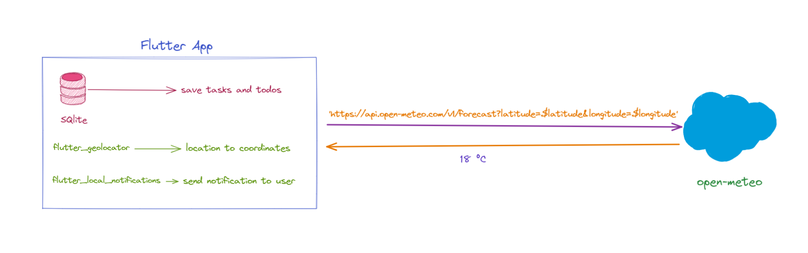

# Finansal Bilgi Teknolojileri Proje Ödevi Yazılım Mimarisi Dökümanı

Geliştirdiğimiz proje bir Android uygulaması. Flutter ile geliştirdik.

3 saatte bir arkaplan işi ile aktif iş varsa kullanıcının telefonunun konumundan hava durumu bilgisini alıp kullanıcıya bildirim atıyoruz. 

Kullandığımız hava durumu API'sinin adı [open-meteo](https://open-meteo.com/en).

Yaptığımız örnek API isteği:

`'https://api.open-meteo.com/v1/forecast?latitude=$latitude&longitude=$longitude&current_weather=true'`

Enlem ve boylam bilgilerini Flutter'da `geolocator` paketiyle elde ediyoruz.

Bildirim göndermek içinse `flutter_local_notifications` paketini kullanıyoruz.

Kullanıcının oluşturduğu görevleri ve işlerin kaybolmaması için bu bilgileri SQlite veritabanında uygulama içinde saklıyoruz.

