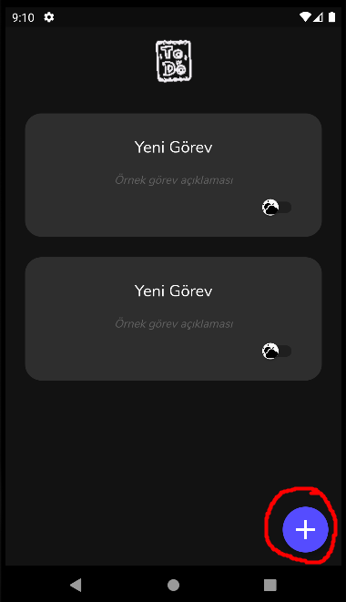
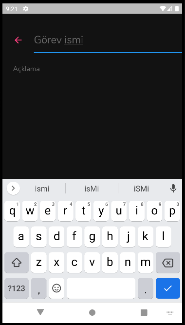
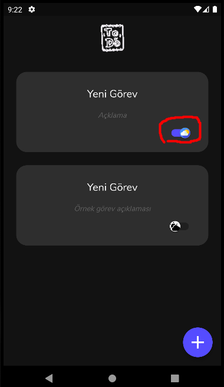
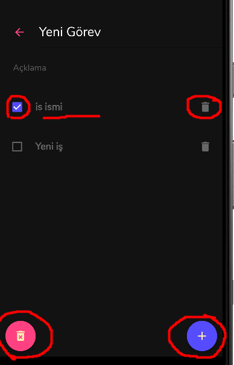

# Finansal Bilgi Teknolojileri Proje Ödevi Test Dökümanı

## Yeni Görev Ekleme

<ol>
  <li>Sağ altta bulunan mavi butona tıklanır.</li>
  <li>Yeni görev eklenmiş olmalıdır.</li>
</ol>

## Görev İsmi ve Açıklama Düzenleme

<ol>
	<li>Ana sayfada bulunan bir görevin üzerine tıklanır.</li>
	<ul>
		<li>Gidilen sayfada görev isminin üzerine tıklanır</li>
		<li>Klavyeden görev ismi değiştirilir ve tamama tıklanır</li>
	</ul>
	 
	<ul>
		<li>Gidilen sayfada görev açıklamasının üzerine tıklanır</li>
		<li>Klavyeden görev açıklaması değiştirilir ve tamama tıklanır</li>
	</ul>
	<li>Değişiklikler bu sayfada ve ana sayfada yansımış mı kontrol edilir.</li>
</ol>

## Görev Aktif Etme

1. Ana sayfada bulunan bir görevin sağ alt tarafındaki hava durumu ikonuna tıklanır.
2. 3 saat sonra bildirim gelmiş mi kontrol edilir.

## Görev Silme

1. Görev ekranında sol altta bulunan kırmızı butona tıklanır.
2. Görev silinmiş mi kontrol edilir.

## Göreve iş ekleme

1. Görev ekranında sağ alttaki butona tıklanır.
2. Yeni iş eklenmiş mi kontrol edilir.

## İş ismini düzenleme

1. Görev ekranında bir işin isminin üzerine tıklanır.
2. İşin adı değiştirilir ve adı değişiyor mu kontrol edilir.

## İş tamamlama 

1. Görev ekranında bir işin solundaki kutucuğa tıklanır.
2. Kutucuğun durumu değişiyor mu kontrol edilir.

## İş Silme

1. Görev ekranında bir işin en sağındaki çöp kutusuna tıklanır.
2. İş siliniyor mu kontrol edilir.

