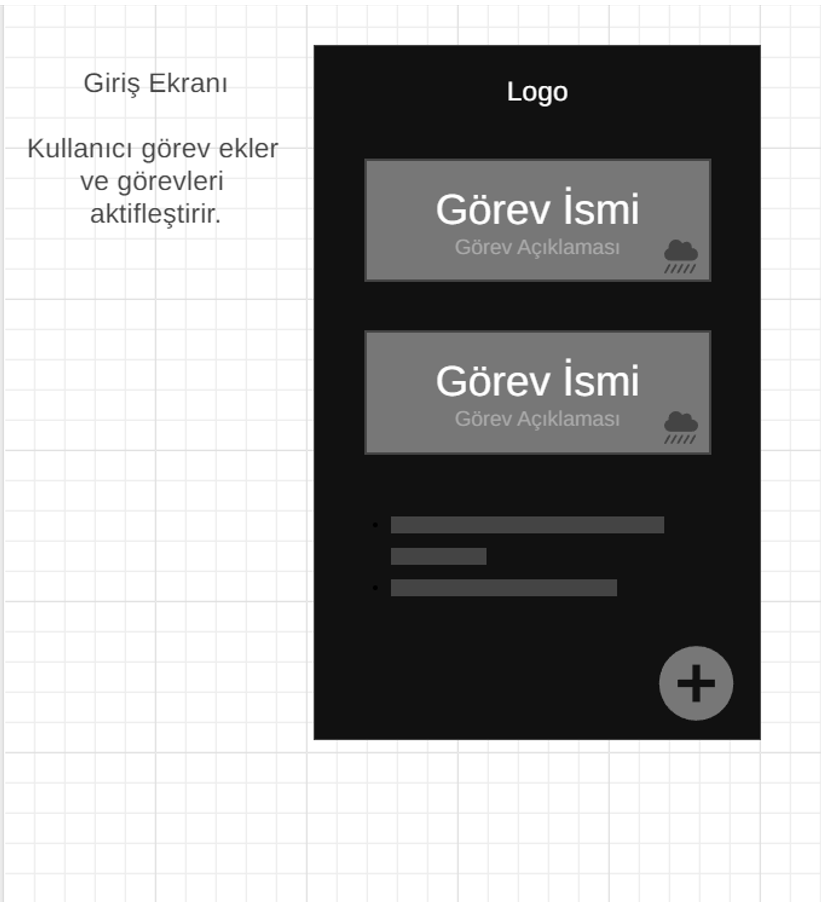
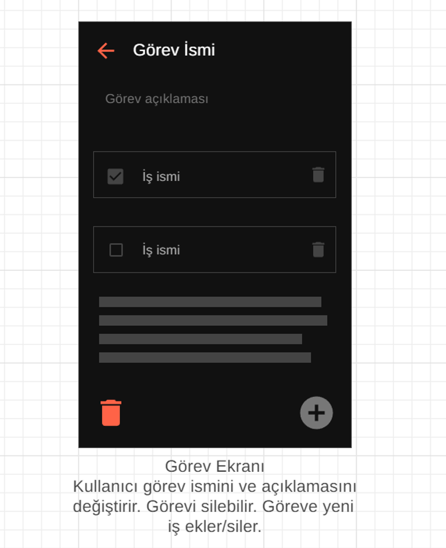

# Finansal Bilgi Teknolojileri Proje Ödevi UX Dökümanı

## Ekranlar

### Ana sayfa

- Arkaplan rengi `#121212` olmalı.
- Görevi aktif edecek buton bir switch olmalı.
	- Aktif olmayan halinin rengi `#1F1F1F` olmalı
	- Aktif rengi ise `#554CFF` olmalı.
- Görev kartının arka plan rengi `#2E2E2E` olmalı.
	- Görev isminin rengi `#FFFFFF` ve boyutu `20 px` olmalı.
	- Görev açıklamasının rengi `#383838` ve boyutu `14 px` olmalı.

- Görev ekleyen sağ alttaki butonun rengi `#554CFF` ve boyutu `40 px ` olmalı.   

### Görev Ekranı

- Arkaplan rengi `#121212` olmalı.
- Görev isminin rengi `#FFFFFF` ve boyutu `24 px` olmalı.
- Geri butonunun rengi `#FF4181`olmalı.
- Görev açıklamasının rengi `#5A5A5A` ve boyutu `16 px` olmalı
- Aktif iş checkbox'unun rengi `#564CFF` olmalı.
- İş isminin rengi `#5A5A5A` ve boyutu `18 px` olmalı. 
- İşi silme butonunun rengi `#686868` olmalı.
- Görevi silme butonunun rengi `#FF4181` olmalı.
- İş ekleme butonunun rengi `#564CFF` olmalı.

